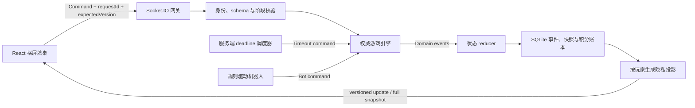
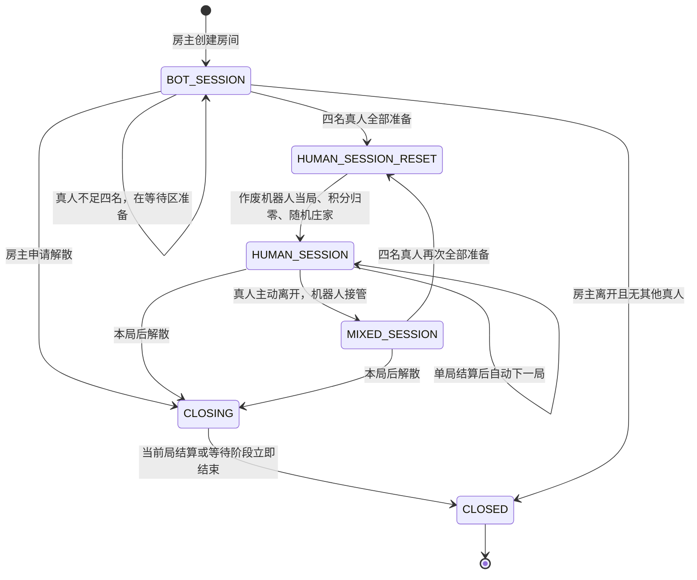
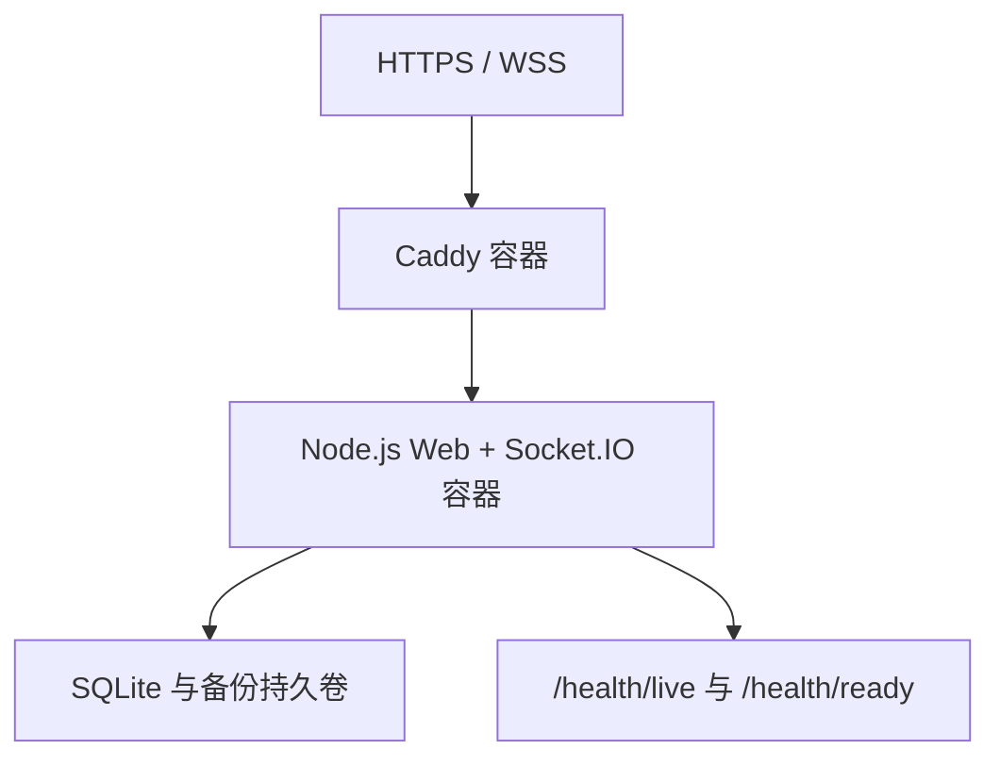

# 晃晃 Web 游戏技术与体验设计

## 1. 设计摘要

本项目采用单仓 TypeScript 架构，在一台 2 vCPU / 4 GiB 阿里云 ECS 上运行。浏览器只提交操作意图并渲染服务端投影；服务端保存唯一权威状态，执行洗牌、合法动作、胡牌、杠分、放赖倍率、定时托管和结算。

首发只面向本人和少量受邀好友，优先目标是规则正确、刷新可恢复、手机横屏易用和单人可维护，不为大规模并发提前建设分布式系统。

## 2. 技术决策

| 领域 | 选择 | 原因 |
|---|---|---|
| 语言 | TypeScript 全栈 | 前后端、协议、状态机和测试共享类型，减少跨层不一致 |
| 前端 | React 19 + Vite，DOM/CSS 渲染 | 牌桌不是高帧率动作游戏；DOM 更适合横屏响应式、主题切换、文本清晰度和无障碍 |
| HTTP 服务 | Node.js 24 LTS + Fastify 当前受支持版本 | 单进程足够小范围使用，插件与校验边界清晰 |
| 实时协议 | Socket.IO 4.x | 支持房间、确认回调、自动重连和临时连接恢复；应用层仍实现版本号与全量重同步 |
| 数据库 | SQLite 当前修复版本，WAL 模式，单写连接 | 单机低运维，事务足够支撑少量房间；不引入独立数据库服务 |
| ORM/查询 | Drizzle ORM 当前稳定版本或薄 SQL 仓储层 | 明确迁移与类型；避免把 ORM 模型泄漏进领域层 |
| 反向代理 | Caddy | 自动 HTTPS，直接代理 HTTP 与 WebSocket，配置量小 |
| 包管理 | pnpm workspace | 单仓共享包、确定性锁文件、较低磁盘占用 |
| 测试 | Vitest + fast-check + Playwright | 单元、性质、集成和真实浏览器横屏流程分层验证 |
| 部署 | Docker Compose 单机 | 开发与服务器环境一致，具备健康检查、持久卷和可回滚镜像 |

不选择 Canvas/Pixi：牌面数量有限，核心是可点击 UI 与状态解释，不需要持续渲染循环。也不选择 Redis、消息队列、Kubernetes或微服务：当前只有一个服务实例与极少量房间，这些组件不会解决真实需求。

## 3. 代码组织

```text
huanghuang/
├── apps/
│   ├── web/                  # React 页面、牌桌、主题和 Socket 客户端
│   └── server/               # HTTP、Socket 网关、房间调度、持久化和运维接口
├── packages/
│   ├── protocol/             # 命令、事件、投影、错误码和运行时 schema
│   ├── game-engine/          # 纯函数规则、状态机、胡牌、结算和机器人策略
│   ├── ui/                   # 牌面、按钮、弹层和两套主题令牌
│   └── config/               # TypeScript、ESLint、Vitest 共享配置
├── deploy/
│   ├── Caddyfile
│   ├── compose.yaml
│   └── scripts/              # 备份、恢复、健康检查和发布脚本
├── docs/
│   ├── rules.md              # 从 PRD 提炼的玩家规则
│   └── operations.md         # 单机部署与故障恢复手册
└── package.json
```

依赖方向固定为：`apps -> packages`，`protocol -> 无业务依赖`，`game-engine -> protocol 的领域基础类型`。前端不得导入服务端仓储类型，服务端网关不得复制胡牌或倍率逻辑。

## 4. 系统边界与数据流



一次合法操作的提交顺序固定为：

1. 网关验证匿名会话、房间成员关系、payload schema 和限流。
2. 房间串行队列比较 `expectedVersion`，检查 `requestId` 是否已处理。
3. 纯游戏引擎根据状态返回领域事件或结构化拒绝原因。
4. SQLite 在一个事务内写入事件、积分账本、请求去重记录和最新快照。
5. 事务提交后更新内存状态，按每名玩家权限生成不同投影并广播。
6. 客户端只以服务端版本为准；版本缺口或恢复失败时请求全量快照。

数据库提交失败时不改变内存状态、不广播成功结果。广播失败不回滚已提交操作，断线客户端重连后通过快照恢复。

## 5. 领域模型

### 5.1 牌

```ts
type TileSuit = "WAN" | "TIAO" | "TONG";
type TileRank = 1 | 2 | 3 | 4 | 5 | 6 | 7 | 8 | 9;

type TileKind = {
  suit: TileSuit;
  rank: TileRank;
};

type Tile = TileKind & {
  id: string; // 108 个实体牌唯一 ID
};
```

规则判断使用 `TileKind`，动作、审计和“本次摸入牌”判断使用实体 `Tile.id`。亮牌实体从牌墙移入 `indicatorTile`；赖子是同花色 `rank % 9 + 1` 的牌型，不新增牌实体。

### 5.2 公开组合

```ts
type MeldKind =
  | "PONG"
  | "EXPOSED_KONG"
  | "CONCEALED_KONG"
  | "ADDED_KONG"
  | "INDICATOR_PONG_KONG";

type Meld = {
  id: string;
  kind: MeldKind;
  tileIds: string[];
  tileKind: TileKind;
  sourcePlayerId: string | null;
  sourceDiscardId: string | null;
  createdAtVersion: number;
};
```

`INDICATOR_PONG_KONG` 有三张牌，在结构上计为一组，在付款上按明杠 3 倍处理，在流程上不补牌。

### 5.3 玩家当局状态

```ts
type RoundPlayerState = {
  seat: 0 | 1 | 2 | 3;
  controller: "HUMAN" | "BOT" | "TRUSTEE";
  concealedTileIds: string[];
  melds: Meld[];
  discards: string[];
  releasedWildcardTileIds: string[];
  releasedWildcardCount: number;
  personalMultiplier: 1 | 2 | 4 | 8 | 16;
  roomScore: number;
  connected: boolean;
};
```

个人倍率每局重置为 1；房间积分跨局累计。控制者变化不改变座位的当前手牌或积分。

### 5.4 房间与牌局

房间保存：6 位码、房主、底分、活动座位、等待真人、准备状态、累计积分、当前局 ID、待解散标记和状态版本。

牌局保存：庄家、完整牌墙及头指针、亮牌、赖子牌型、最后成功摸牌者、当前行动座位、阶段、截止时间、上一次摸牌实体、最近弃牌、可响应者、四名玩家状态和结算记录。

## 6. 房间生命周期



- 创建房间后房主占据一个活动座位，其余三席为机器人，并自动开始机器人过渡局。
- 受邀真人进入等待区并点击准备，不接管进行中的机器人手牌。
- 四名真人全部准备时立即作废未完成机器人局，清空四席积分，重新随机庄家并发牌。
- 真人主动离开时机器人立即接管；断线仅切换为托管，原匿名身份重连后取回控制。
- 房主主动离开时从其他在线真人中随机转让房主；没有其他真人则立即关闭房间。
- 房主在活动局中申请解散，只设置 `dissolveAfterRound`；当前局正常结算后关闭。

## 7. 单局状态机

### 7.1 阶段

| 阶段 | 允许的主要动作 | 退出条件 |
|---|---|---|
| `ROUND_SETUP` | 无客户端动作 | 洗牌、发牌、翻亮牌、确定赖子完成 |
| `TURN_DECISION` | 胡、放赖、暗杠、补杠、弃牌、继续出牌 | 动作产生下一阶段或结算 |
| `RELEASE_REPLACEMENT` | 无客户端动作 | 从牌墙前端补牌并回到 `TURN_DECISION` |
| `KONG_REPLACEMENT` | 无客户端动作 | 即时杠分、前端补牌并回到 `TURN_DECISION` |
| `DISCARD_RESPONSE` | 碰、明杠、亮牌特殊碰、过 | 唯一响应者动作或 5 秒超时 |
| `ROUND_SETTLEMENT` | 无游戏动作 | 写入单局结果并展示 |
| `BETWEEN_ROUNDS` | 房主可维持待解散状态 | 自动开始下一局或关闭房间 |
| `ROUND_ABORTED_FOR_HUMANS` | 无游戏动作 | 四真人切换事务完成 |

庄家拿到 14 张后直接进入 `TURN_DECISION`。其他玩家轮到时，服务端先从牌墙前端摸一张，再进入该阶段。普通碰和亮牌特殊碰后不摸牌，但仍进入 `TURN_DECISION`；此时只允许直接弃牌或放赖，不能立即自摸、暗杠或补杠。放赖补牌后产生新的自摸牌，才重新计算自摸与杠动作。

### 7.2 回合合法动作生成

服务端每次状态变化后计算 `legalActions`，客户端只渲染该集合：

- `DECLARE_WIN`：玩家本回合存在属于自己的新摸实体牌，且硬胡或软胡成立；碰牌本身不构成自摸来源。
- `CONTINUE_TURN`：主动放弃本次胡牌机会。
- `RELEASE_WILDCARD`：当前处于合法出牌阶段、手中有赖子且牌墙非空；补牌再次摸到赖子时，同一回合可继续执行。
- `DECLARE_CONCEALED_KONG`：本回合存在属于自己的新摸实体牌，四张同牌均非赖子且牌墙非空。
- `DECLARE_ADDED_KONG`：本回合存在属于自己的新摸实体牌，已有普通碰、摸到第四张非赖子且牌墙非空。
- `DISCARD_TILE`：选择非赖子暗牌。
- `CLAIM_PONG`：持有两张与弃牌相同的非赖子牌。
- `CLAIM_EXPOSED_KONG`：持有三张与弃牌相同的非赖子牌且牌墙非空。
- `CLAIM_INDICATOR_PONG_KONG`：持有剩余两张亮牌并响应第三张亮牌。
- `PASS_RESPONSE`：放弃 5 秒响应。

赖子永远不出现在普通弃牌、碰或杠的合法候选中。

### 7.3 倒计时与托管

- `TURN_DECISION` 截止时间为服务端时间加 15 秒。
- `DISCARD_RESPONSE` 截止时间为服务端时间加 5 秒。
- 客户端显示 `deadlineAt - serverNow`，但倒计时归零与自动动作只由服务端触发。
- 主动阶段超时优先级：硬胡、软胡、两张及以上赖子时放一张、弃本回合新摸的合法牌、随机合法普通弃牌。
- 单赖子不会被托管主动放出。
- 响应阶段超时一律过，不自动碰杠。
- 服务重启后读取持久化截止时间；已过期则立即提交一次带确定 `requestId` 的超时命令。

## 8. 胡牌算法

### 8.1 输入与输出

```ts
type WinEvaluationInput = {
  concealedTiles: Tile[];
  melds: Meld[];
  wildcardKind: TileKind;
  winningTileId: string;
};

type WinEvaluation = {
  canWin: boolean;
  winType: "HARD" | "SOFT" | null;
  wildcardUsedAsSubstitute: boolean;
  wildcardSubstituteKind: TileKind | null;
  decomposition: Array<{
    kind: "SEQUENCE" | "TRIPLET" | "KONG" | "PAIR";
    tileIds: string[];
  }>;
  rejectionCode: string | null;
};
```

### 8.2 判定顺序

1. 检查公开组合是否合法，且公开组数不超过 4。
2. 统计暗牌中的赖子实体；超过 1 张返回 `TOO_MANY_WILDCARDS`。
3. 计算暗牌应完成的组数 `4 - melds.length`，验证暗牌数量与结构相容。
4. 将赖子按原牌型计数，用递归拆分或记忆化搜索寻找“所需暗组 + 一对将”。找到则返回硬胡。
5. 没有赖子时返回不能胡。
6. 枚举唯一赖子可替代的 27 种牌型，对每种执行标准结构搜索。
7. 任何候选中，两张赖子作将均无效；当前规则总量限制也会提前拒绝该情况。
8. 若候选分解的将牌恰好由 `winningTileId` 与赖子实体组成，则该候选属于“任意牌成将”禁胡解释并丢弃；如果存在另一种不以这两张作将的合法分解，仍可软胡。
9. 存在剩余候选则返回软胡，并选择稳定的字典序最小替代结果用于展示与重放。
10. 所有候选失败则返回不能胡。

搜索按花色拆分并使用计数数组缓存，状态空间极小。测试必须同时验证实体 ID 角色，防止只看牌值时误放过禁胡等待型。

## 9. 放赖与倍率

放赖是原子命令：

1. 验证处于 `TURN_DECISION`、目标实体是本局赖子且牌墙非空；不设置每回合次数上限。
2. 从暗牌移除赖子并加入本人公开放赖区。
3. `releasedWildcardCount += 1`，`personalMultiplier *= 2`。
4. 从牌墙前端补一张并记录为新的 `winningTileId`。
5. 重新计算胡、杠和弃牌合法动作，刷新 15 秒截止时间。

同局四张赖子一旦放出便永久离开可操作牌区。下一局所有放赖区清空，个人倍率归 1。

## 10. 计分与账本

### 10.1 自摸

对每个输家单独计算：

```text
应付分 = 房间底分
       × 胡牌基础倍率（软胡 1，硬胡 2）
       × 赢家当局个人倍率
       × 该输家当局个人倍率
```

三笔付款放在一个数据库事务中，赢家增量等于三名输家减少量之和。庄家不加倍。每个付款人的理论最高倍率为 32。

### 10.2 杠

| 动作 | 付款人 | 每名付款额 | 是否补牌 |
|---|---|---:|---|
| 明杠 | 打出第四张者 | 底分 × 3 | 是，牌墙前端 |
| 暗杠 | 其他三家 | 各底分 × 2 | 是，牌墙前端 |
| 补杠 | 其他三家 | 各底分 × 1 | 是，牌墙前端 |
| 亮牌特殊碰 | 打出第三张亮牌者 | 底分 × 3 | 否 |
| 普通碰 | 无 | 0 | 否 |

杠分不乘双方个人倍率，动作成立后即时写入账本，随后流局仍保留。需要补牌但牌墙为空时，动作根本不进入 `legalActions`。

### 10.3 账本不变量

- 每笔结算的所有 `delta` 之和必须为 0。
- 同一 `settlementId` 只可提交一次。
- 账本只追加，不直接改历史记录；房间当前分数由账本投影得到。
- 四真人切换时使用明确的 `SESSION_SCORE_RESET` 事件开始新计分段，不删除技术审计记录。

## 11. 实时协议

### 11.1 命令封套

```ts
type CommandEnvelope<TType extends string, TPayload> = {
  type: TType;
  requestId: string;
  roomId: string;
  roundId: string | null;
  expectedVersion: number;
  payload: TPayload;
};
```

服务端响应包含：`accepted`、`requestId`、`serverVersion`、`errorCode`、`message`。相同会话重复提交同一 `requestId` 时返回第一次结果，不再次执行。

### 11.2 主要命令

- `CREATE_ROOM`
- `JOIN_ROOM`
- `SET_READY`
- `LEAVE_ROOM`
- `REQUEST_DISSOLVE_AFTER_ROUND`
- `DECLARE_WIN`
- `CONTINUE_TURN`
- `RELEASE_WILDCARD`
- `DISCARD_TILE`
- `CLAIM_PONG`
- `CLAIM_EXPOSED_KONG`
- `DECLARE_CONCEALED_KONG`
- `DECLARE_ADDED_KONG`
- `CLAIM_INDICATOR_PONG_KONG`
- `PASS_RESPONSE`

客户端不得发送 `DECLARE_SOFT_WIN`、`DECLARE_HARD_WIN`、倍率、分数变化、摸牌结果或机器人动作结果。

### 11.3 服务端更新

```ts
type ServerUpdate = {
  eventId: string;
  roomId: string;
  version: number;
  kind: string;
  projection: PlayerRoomProjection;
};
```

Socket.IO 保证同一连接的消息顺序，但默认到达语义不是可靠事件流。因此应用层保存事件 ID 与版本：

- 连续版本可直接覆盖客户端投影。
- 收到版本跳跃、恢复失败或页面刷新时调用 `GET /api/rooms/:code/snapshot`。
- 命令通过确认回调返回；客户端超时可用相同 `requestId` 重试。
- 服务端任何时候都可发送完整玩家投影，前端不能用本地动作推演权威手牌。

## 12. 隐私投影

同一权威状态生成四份不同玩家投影：

- 本人：暗牌实体、可操作集合、等待胡牌解释、个人倍率、倒计时。
- 对手：暗牌数量、公开组合、弃牌、放赖区、积分、连接/托管状态。
- 等待区真人：房间规则、座位控制者、准备状态、公开比分；看不到任何活动牌局暗牌、牌墙或机器人决策输入。
- 技术日志：可保存完整牌墙与动作供 7 天排查，但不通过普通玩家接口返回。

投影函数位于 `game-engine` 或专门的 `projection` 模块，Socket handler 不得手工删字段。

## 13. 持久化设计

### 13.1 表

| 表 | 关键字段 | 用途 |
|---|---|---|
| `anonymous_sessions` | id, token_hash, nickname, created_at, last_seen_at | 浏览器匿名身份与恢复 |
| `rooms` | id, code, owner_id, base_score, status, version, dissolve_after_round | 房间元数据 |
| `room_participants` | room_id, participant_id, seat, role, ready, joined_at | 活动席与等待真人 |
| `rounds` | id, room_id, dealer_seat, indicator, wildcard, status, started_at, ended_at | 单局索引 |
| `game_events` | id, room_id, round_id, seq, type, payload_json, created_at | 追加式领域事件 |
| `room_snapshots` | room_id, version, state_json, created_at | 崩溃恢复快照 |
| `score_ledger` | id, room_id, round_id, settlement_id, seat, delta, reason | 零和积分账本 |
| `processed_requests` | session_id, request_id, result_json, expires_at | 幂等去重 |
| `technical_logs` | id, room_id, level, code, context_json, created_at | 7 天故障排查 |

### 13.2 写入策略

- 每个房间拥有内存串行队列，单机内不并发修改同一房间。
- 每个接受命令都在单个 SQLite 事务中写事件、账本、请求结果和最新快照。
- SQLite 只使用一个应用写连接；读取可复用受控连接池。
- 使用已包含 2026 年 WAL 修复的 SQLite 版本，启动时检查运行库版本。
- 备份使用 SQLite 在线备份 API 或一致性导出，不直接复制运行中的数据库主文件。
- 已关闭房间的完整状态在 7 天后清理，仅保留部署级别必要统计；用户无历史查询入口。

## 14. 匿名身份与安全

- 首次输入昵称后，服务端生成不可预测会话 ID 和恢复密钥；恢复密钥只放 `Secure`、`HttpOnly`、`SameSite=Lax` Cookie，数据库只存哈希。
- 昵称按 Unicode 字符数限制 1 至 12，去控制字符，输出时永远按文本渲染。
- 6 位房间码使用加密安全随机数生成，活动房间内唯一，关闭即失效。
- 创建、加入、错误房间码和 Socket 握手按 IP 与会话限流，降低枚举房间码风险。
- 所有命令验证成员、控制座位、当前阶段、版本、实体牌归属和合法动作。
- `expectedVersion` 防止旧页面操作新状态，`requestId` 防重复，账本唯一键防重复付款。
- 随机洗牌使用密码学安全随机源执行 Fisher-Yates；完整牌墙只进入私有状态与短期技术记录。
- Caddy 终止 HTTPS；应用只监听容器内网端口；数据库、备份和环境文件不暴露公网。
- 不记录 Cookie、恢复密钥或完整请求头；7 天日志任务每日清理。

## 15. 机器人设计

机器人与托管均通过正常命令接口行动，不能直接修改状态。

基础机器人策略：

1. 可硬胡时胡。
2. 可软胡时胡，不主动用单赖子追求软转硬。
3. 两张及以上赖子时放一张。
4. 有合法杠时根据固定策略执行；首版可全部执行以覆盖玩法。
5. 碰牌仅在碰后不增加明显孤张时执行；亮牌特殊碰优先执行。
6. 弃牌评分依次考虑是否为新摸牌、孤张、边张、与现有牌的顺子连接数、对子/刻子保留和赖子禁弃。
7. 同分候选使用服务端安全随机选择并记录结果。

机器人不读取其他玩家暗牌或牌墙，保证与真人拥有相同信息边界。高级牌效、难度等级和作弊式全知 AI 不属于 MVP。

## 16. 前端信息架构

### 16.1 页面

1. 主页：创建房间、加入房间、邀请好友；右上角只保留主题与声音入口。
2. 创建房间：昵称、底分 `1/2/5/10`，默认 2；创建后进入牌桌。
3. 加入房间：6 位码、昵称；邀请链接自动填码。
4. 等待层：等待真人头像/昵称、准备状态、房间规则、复制邀请链接；不显示牌局私有信息。
5. 横屏牌桌：四席、牌墙数、亮牌/赖子、公开组、弃牌区、放赖区、本人手牌、倒计时和操作栏。
6. 单局结算：赢家、软硬胡、个人倍率、逐人付款、杠分、本局净变化和累计积分。
7. 解散结算：四席最终累计积分、截图友好的静态布局、返回主页。
8. 恢复状态：正在重连、已由托管接管、快照恢复成功、房间已关闭。

### 16.2 横屏牌桌布局

```text
┌──────────────────────────────────────────────────────────────┐
│ 房间码 / 底分 / 主题      对家公开区       房主菜单 / 声音   │
│                                                              │
│ 左家公开区     牌墙余数  亮牌  赖子  当前行动     右家公开区 │
│ 放赖区         中央弃牌与最近动作提示区域          放赖区    │
│                                                              │
│ 本人公开组      本人放赖区      倍率 / 积分 / 15秒倒计时     │
│                 本人横向手牌，可横向压缩但不缩小点击区       │
│          [硬胡/软胡] [放赖] [碰/杠] [继续] [确认出牌]       │
└──────────────────────────────────────────────────────────────┘
```

触控目标最小 44×44 CSS 像素；手牌选中采用上移、轮廓与文本提示三种反馈，不只依赖颜色。横屏高度不足时优先压缩中央弃牌间距，不缩小本人牌面和操作按钮。

## 17. 双主题设计系统

主题通过根节点 `data-theme="discreet|premium"` 和 CSS 自定义属性切换。组件结构、布局尺寸、可访问名称和业务状态完全共享。

### 17.1 低调模式

- 默认主题；暖灰画布、炭黑文字、低饱和蓝灰/棕灰语义色。
- 牌面扁平，使用清晰中文数字、花色简称与少量线性符号，不用传统大面积红绿蓝麻将配色。
- 边框 1px、圆角 6 至 10px、几乎无阴影；赖子用双线框与小“赖”角标，不用发光。
- 动效限制为 120 至 180ms 的透明度与轻微位移；放赖和结算不出现粒子效果。
- 默认静音，浏览器标题与图标保持中性但不伪装成其他产品。
- 推荐字体：系统中文字体搭配 Geist Sans；不依赖远程字体才能识牌。

### 17.2 精美模式

- 深墨绿或深漆黑桌面、暖象牙牌、低饱和黄铜点缀，避免霓虹渐变。
- 牌与重要面板使用克制的双层边框和内高光，纹理固定在低透明度背景层。
- 出牌、碰杠、放赖使用 220 至 480ms 物理感位移和缩放，只动画 `transform` 与 `opacity`。
- 赖子可有柔和边缘高光，亮牌与赖子并列形成固定视觉锚点。
- 音效独立开关并记忆本地偏好，任何主题都可静音。

### 17.3 主题验收

- 两主题截图中的所有信息位置一致。
- 色觉模拟下仍能区分本人选牌、赖子、不可操作与倒计时警告。
- 在 667×375、844×390、932×430 和桌面 1440×900 视口完成视觉回归。
- `prefers-reduced-motion` 下取消非必要移动，只保留状态瞬切或淡入。

## 18. 单机部署



- Caddy 对外开放 80/443，自动申请和续期证书，代理 WebSocket。
- Node 容器使用 Node 24 LTS，单进程运行；Docker 设置 `restart: unless-stopped`。
- SQLite 数据与 Caddy 证书目录使用具名持久卷。
- 每日执行一致性备份并保留 7 份；发布前额外备份一次。
- 阿里云安全组只开放 SSH 管理端口和 80/443；SSH 使用密钥，关闭密码登录作为运维建议。
- CloudMonitor 观察 CPU、内存、磁盘和公网带宽；应用记录活动房间数、Socket 数、命令拒绝率、事件循环延迟、数据库事务耗时和恢复失败数。

现阶段不承诺并发容量。部署后只进行针对个人好友规模的烟雾压测，确保 2 核 4G 在目标使用方式下有充足余量。

## 19. 故障恢复与回滚

- 进程崩溃：容器自动重启，从最新快照恢复活动房间，补放快照后的事件，重建定时器。
- 客户端断线：立即标记托管；临时 Socket 恢复成功则补包，否则发送全量私有快照。
- 数据库事务失败：操作拒绝，状态版本不前进；客户端保留当前投影并显示可重试提示。
- 数据库损坏：停止写入，从最近一致性备份恢复；不尝试拼接不完整账本。
- 发布失败：保留上一镜像标签与兼容数据库迁移；回滚应用镜像。破坏性迁移必须拆为扩展、切换、清理三次发布。
- Caddy 重载可能断开 WebSocket；客户端自动重连并通过版本快照恢复，不依赖连接永久存在。

## 20. 测试策略

### 20.1 规则单元与性质测试

- 108 张牌唯一性、花色数量、洗牌无丢牌重复、亮牌移除、9 到 1 循环。
- 四组加一对、公开组合减少暗组数、0 至 4 个顺子。
- 无赖子硬胡、赖子原牌硬胡、单赖子软胡、多赖子拒绝、硬胡优先。
- 赖子用于顺子、刻子、既有单张将；拒绝赖子与本次摸牌组成任意牌将。
- 赖子永不进入碰杠候选或普通弃牌候选。
- 放赖可发生在正常摸牌、杠后补牌、普通碰和亮牌特殊碰之后。
- 牌墙为空时不生成放赖或杠动作。
- 任意合法结算后四席积分增量总和为 0。

### 20.2 状态机与协议测试

- 非当前玩家、旧版本、错误实体牌、重复请求、非法阶段全部被拒绝且状态不变。
- 15 秒和 5 秒超时只执行一次；服务重启后的过期定时器也只执行一次。
- Socket 丢包、重复、乱序重试、页面刷新最终收敛到同一版本投影。
- 每名玩家只能看到自己的暗牌；等待区看不到机器人或活动真人暗牌。
- 杠分事务、三家自摸付款和四真人积分重置满足幂等与零和。

### 20.3 端到端测试

- 房主创建 2 分房、机器人局自动开始、复制邀请链接。
- 三名浏览器访客加入、准备、终止机器人局、四真人归零重发。
- 完成碰后放赖、补牌、出牌的完整链路。
- 软胡主动胡、软胡超时自动胡、软胡放赖后转硬胡。
- 明杠、暗杠、补杠和亮牌特殊碰逐笔验证付款。
- 真人离开由机器人接管；刷新后恢复；房主离开随机转让。
- 房主请求本局后解散，当前局结算后展示最终积分并返回主页。
- 低调与精美主题在四类目标视口完成截图差异与布局一致性检查。

## 21. 主要风险与控制

| 风险 | 后果 | 控制 |
|---|---|---|
| 胡牌算法只按牌值、不保留摸牌实体 | 错误放过任意牌成将禁胡 | 实体 ID 输入、分解角色与专项测试 |
| 客户端自行推演动作 | 重连后状态漂移或作弊 | 只提交意图，服务端投影覆盖 |
| Socket 默认至多一次到达 | 动作丢失或重试重复 | ack、requestId、version、持久化快照 |
| 杠分已付但本局后续流局 | 玩家误以为分数应回滚 | 独立账本原因码与结算页拆分展示 |
| 机器人局切换真人局 | 混入机器人积分或手牌 | 单事务作废当局、归零、重新洗牌定庄 |
| 单机故障 | 所有房间短暂中断 | 快照、自动重启、每日一致性备份 |
| 两主题形成两套业务实现 | 功能漂移、测试翻倍 | 单 DOM、单状态、CSS 令牌切换 |

## 22. 兼容与演进

- 协议消息带 `schemaVersion`；只做向后兼容字段扩展，破坏性修改提升版本并拒绝旧客户端。
- 数据迁移遵循先加字段、双读写、切换、最后清理；保证上一镜像可回滚。
- 如果未来需要公开匹配或多实例，先抽象房间目录和持久事件存储，再评估 Redis Streams；MVP 不预埋空接口。
- 如果未来增加特殊牌型，必须把牌型识别与倍率表独立扩展，不能改写标准胡主路径。

## 23. 技术依据

- Node.js 官方发布页：Node 24 当前为 LTS，生产应用应使用 LTS 分支。https://nodejs.org/en/about/previous-releases
- React 官方版本页：当前主版本为 React 19.2。https://react.dev/versions
- Socket.IO 连接恢复：临时断线可恢复会话与遗漏数据，但官方明确要求恢复失败时仍进行状态同步。https://socket.io/docs/v4/connection-state-recovery
- Socket.IO 到达语义：默认是至多一次，额外可靠性必须由应用实现。https://socket.io/docs/v4/delivery-guarantees
- SQLite WAL 文档与 2026 修复说明。https://sqlite.org/wal.html
- Caddy 自动 HTTPS 与 WebSocket 反向代理。https://caddyserver.com/docs/automatic-https 和 https://caddyserver.com/docs/caddyfile/directives/reverse_proxy
