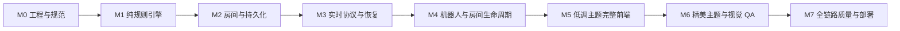

# 晃晃 Web 游戏实施计划

## 1. 实施原则

- 先完成纯规则引擎，再接实时服务和 UI；任何界面不得先复制一套临时规则。
- 每个里程碑必须通过自动化门槛后才能进入下一阶段。
- 服务端始终权威，所有跨层数据只使用 `packages/protocol` 的 schema 和类型。
- 先交付默认低调模式的完整可玩闭环，再增加精美主题；两者不得分叉业务组件。
- 先在本机和 CI 验证，再部署现有阿里云 2 核 4G；本任务规划完成后仍需用户明确批准才能执行实现。

## 2. 里程碑与依赖



## 3. M0：工程骨架与项目规范

### 交付物

- pnpm workspace 与 `apps/web`、`apps/server`、`packages/protocol`、`packages/game-engine`、`packages/ui`、`packages/config`。
- Node 24 LTS、TypeScript strict、ESLint、Prettier、Vitest、Playwright 基础配置。
- Docker Compose、Caddy 本地配置、环境变量 schema 和示例环境文件。
- 基于实际生成代码补齐 `.trellis/spec/frontend/` 与 `.trellis/spec/backend/`，结束当前 bootstrap 占位状态。
- CI 基础流水线：安装、lint、typecheck、unit test、build。

### 清单

- [ ] 初始化根 `package.json`、`pnpm-workspace.yaml` 和锁文件。
- [ ] 固定 Node 24 LTS 与 pnpm 版本，增加版本检查。
- [ ] 建立共享 TypeScript 配置，禁止隐式 `any` 与不受控类型断言。
- [ ] 建立前后端目录边界和导入规则。
- [ ] 配置单元、集成和 E2E 测试项目。
- [ ] 建立开发 Compose，验证 Caddy 到 HTTP 与 Socket 的代理。
- [ ] 将真实目录和代码模式写入 Trellis 前后端规范。

### 验证

```bash
pnpm install --frozen-lockfile
pnpm lint
pnpm typecheck
pnpm test
pnpm build
docker compose -f deploy/compose.yaml config
```

### 回滚点

工程骨架不包含数据库迁移或业务数据；若技术组合不可用，可在 M1 前替换构建工具，不影响领域设计。

## 4. M1：纯游戏规则引擎

### 交付物

- 108 张牌模型、加密安全洗牌接口、发牌与亮牌/赖子计算。
- 标准“四组加一对”胡牌算法及实体 ID 分解结果。
- 硬胡、软胡、多赖子拒绝、硬胡优先和任意牌成将禁胡。
- 碰、三类杠、亮牌特殊碰、放赖、前端补牌和牌墙为空规则。
- 自摸与杠的零和账本计算。
- 完整状态机 reducer 与合法动作生成器。
- 规则单元测试、表格测试与性质测试。

### 清单

- [ ] 定义不可变领域类型和错误码。
- [ ] 实现牌墙构建、唯一实体 ID、Fisher-Yates 洗牌与测试 RNG 注入。
- [ ] 实现发牌、随机定庄、亮牌移除和 9 到 1 的赖子计算。
- [ ] 实现公开组合验证与所需暗组数计算。
- [ ] 实现无赖子标准胡搜索与缓存。
- [ ] 实现赖子原牌硬胡路径。
- [ ] 实现 27 种替代软胡搜索和稳定分解选择。
- [ ] 实现基于 `winningTileId` 的任意牌成将候选拒绝。
- [ ] 实现 `legalActions`，确保赖子不进入普通弃牌与碰杠集合。
- [ ] 实现普通碰和亮牌特殊碰后只能弃牌或放赖；放赖补牌后重新生成自摸与杠动作，并支持同回合连续放赖。
- [ ] 实现明杠、暗杠、补杠及亮牌特殊碰的固定杠分。
- [ ] 实现逐付款人的自摸公式和 32 倍理论上限断言。
- [ ] 实现流局、下一庄家和每局个人倍率重置。
- [ ] 增加状态序列性质测试：牌实体守恒、零和、阶段合法、版本单调。

### 验证

```bash
pnpm --filter @huanghuang/game-engine lint
pnpm --filter @huanghuang/game-engine typecheck
pnpm --filter @huanghuang/game-engine test --run
pnpm --filter @huanghuang/game-engine test:property --run
```

### 审查门槛

- 所有 PRD 规则至少有一个正例与一个反例。
- 胡牌与结算模块不依赖网络、数据库、系统时间或真实随机源。
- 任意命令返回事件或明确拒绝，不在 reducer 内抛出未分类异常。

### 回滚点

若软胡分解或禁胡等待型定义发现缺陷，只回滚 M1 的纯引擎提交；M2 不得在 M1 审查完成前开始。

## 5. M2：数据库、房间服务与崩溃恢复

### 交付物

- SQLite schema、迁移、单写连接和一致性备份脚本。
- 匿名会话、房间、参与者、单局、事件、快照、账本与请求去重仓储。
- 每房间串行命令队列。
- 从快照加事件恢复活动房间。
- 7 天日志与关闭房间清理任务。

### 清单

- [ ] 编写初始迁移和数据库约束。
- [ ] 为 `room_id + seq`、`session_id + request_id`、`settlement_id + seat` 建立唯一键。
- [ ] 配置 WAL、忙等待、外键和单写连接。
- [ ] 实现命令事务：事件、账本、去重结果、快照同时提交。
- [ ] 实现进程启动恢复和状态校验。
- [ ] 实现持久化截止时间与定时器重建。
- [ ] 实现在线备份、恢复演练与版本检查。
- [ ] 实现 7 天清理任务，确认不删除活动房间数据。

### 验证

```bash
pnpm --filter @huanghuang/server db:migrate:test
pnpm --filter @huanghuang/server test:repository --run
pnpm --filter @huanghuang/server test:recovery --run
pnpm --filter @huanghuang/server test:idempotency --run
pnpm --filter @huanghuang/server db:backup:verify
```

### 审查门槛

- 在事务提交前杀死进程，重启后不得出现半笔杠分或半笔自摸付款。
- 相同请求重放 100 次只产生一组事件和一笔结算。
- 从备份恢复后账本总和、房间版本和快照校验通过。

### 回滚点

数据库迁移只允许向前新增表和字段。M2 结束前保存空库基线与迁移前备份，禁止引入不可逆删除。

## 6. M3：实时协议、身份与隐私投影

### 交付物

- Fastify HTTP API、Socket.IO 网关和共享运行时 schema。
- 匿名 Cookie 身份、6 位房间码、邀请链接和限流。
- 命令确认、请求重试、版本缺口检测、全量快照和断线恢复。
- 四类隐私投影：本人、对手、等待真人、技术日志。
- 15 秒主动回合和 5 秒响应窗口的服务端定时器。

### 清单

- [ ] 在 `packages/protocol` 定义所有命令、响应、更新、投影和错误码。
- [ ] 为每个外部 payload 提供单一运行时 decoder。
- [ ] 实现匿名身份创建、Cookie 恢复与昵称净化。
- [ ] 实现创建/加入房间 HTTP 流程与 Socket 身份绑定。
- [ ] 实现命令 ack、相同 requestId 重试和 expectedVersion 冲突响应。
- [ ] 实现全量玩家快照端点和版本缺口恢复。
- [ ] 启用 Socket.IO 临时恢复，但始终保留失败后的全量同步路径。
- [ ] 实现投影快照测试，证明任何对手暗牌都不泄漏。
- [ ] 实现 IP/会话加入限流和无效房间码限流。
- [ ] 实现服务端 deadline 广播与过期命令。

### 验证

```bash
pnpm --filter @huanghuang/protocol test --run
pnpm --filter @huanghuang/server test:api --run
pnpm --filter @huanghuang/server test:socket --run
pnpm --filter @huanghuang/server test:privacy --run
pnpm --filter @huanghuang/server test:timeout --run
```

### 审查门槛

- 删除一个 Socket 更新、重复一个命令或刷新浏览器后，客户端最终投影与服务端一致。
- 等待区、对手和未认证请求无法获得暗牌实体、牌墙或合法动作内部解释。
- 客户端提交倍率、摸牌结果、胡牌类型或机器人结果均被 schema 拒绝。

### 回滚点

协议使用显式 `schemaVersion`。发布期间保留上一版本 decoder；若恢复异常，可回滚网关而无需回滚纯引擎。

## 7. M4：机器人与完整房间生命周期

### 交付物

- 房主创建后自动开始一人三机器人过渡局。
- 等待真人、准备、四真人原子切换与积分归零。
- 非房主离开机器人接管、断线托管、重连取回。
- 房主随机转让、无人真人立即关闭、本局后解散和自动续局。
- 基础机器人决策与确定性测试。

### 清单

- [ ] 实现活动座位与等待参与者分离模型。
- [ ] 实现创建房间后机器人补满并自动开局。
- [ ] 实现等待真人准备，不暴露活动牌局私有信息。
- [ ] 实现四真人切换事务：作废当前机器人局、积分归零、随机定庄、重新发牌。
- [ ] 实现断线 `TRUSTEE` 与主动离开 `BOT` 的不同语义。
- [ ] 实现房主离开后的在线真人随机转让。
- [ ] 实现无其他真人时立即关闭房间。
- [ ] 实现 `dissolveAfterRound` 和单局结算后自动续局。
- [ ] 实现机器人胡、放赖、碰杠和弃牌策略。
- [ ] 确认机器人只使用自身投影与公开信息。

### 验证

```bash
pnpm --filter @huanghuang/server test:room-lifecycle --run
pnpm --filter @huanghuang/game-engine test:bot --run
pnpm --filter @huanghuang/server test:handoff --run
pnpm --filter @huanghuang/server test:dissolve --run
```

### 审查门槛

- 所有真人离开、断线、重连和补齐顺序均不会出现两个控制者控制同一座位。
- 四真人切换后看不到机器人旧手牌、旧庄家、旧倍率或旧积分。
- 房主解散不会截断进行中的真人当局。

### 回滚点

机器人策略与房间状态转换分别提交。策略问题可回滚为只执行超时托管，不影响房间生命周期。

## 8. M5：低调主题完整前端

### 交付物

- 简洁主页、创建房间、加入房间、等待层、横屏牌桌、单局结算、解散结算和恢复状态。
- 默认低调主题、默认静音、本地主题偏好。
- 所有合法动作、倒计时、断线托管和错误反馈。
- 关键横屏视口视觉回归与 Playwright 主流程。

### 清单

- [ ] 建立 Socket 投影 store，禁止前端复制 reducer。
- [ ] 实现主页三个主要入口。
- [ ] 实现底分 `1/2/5/10`，默认 2。
- [ ] 实现 6 位码输入、URL 自动填码、系统分享与复制回退。
- [ ] 实现等待参与者和准备状态。
- [ ] 实现四方牌桌与本人手牌选择。
- [ ] 实现亮牌、赖子、公开组合、弃牌、放赖区和个人倍率。
- [ ] 实现硬胡、软胡、继续、放赖、碰和三类杠按钮。
- [ ] 实现 15 秒/5 秒倒计时和服务端校时。
- [ ] 实现低调主题令牌、简化牌面、默认静音和 reduced-motion。
- [ ] 实现单局逐人付款解释和最终累计积分页。
- [ ] 实现横屏提示、断线提示、托管提示和全量恢复。

### 验证

```bash
pnpm --filter @huanghuang/web lint
pnpm --filter @huanghuang/web typecheck
pnpm --filter @huanghuang/web test --run
pnpm e2e --project=chromium
pnpm visual:test --theme=discreet
pnpm build
```

### 审查门槛

- 667×375 视口下本人牌和所有操作按钮可点击，无水平页面滚动。
- 不依赖颜色即可区分赖子、选中牌、禁用动作和当前行动者。
- 页面刷新后不短暂显示其他玩家暗牌或错误手牌。

### 回滚点

低调主题是首个可发布 UI 基线。M6 只增加主题令牌与表现，不修改 M5 业务组件。

## 9. M6：精美主题与视觉质量

### 交付物

- 深色漆面桌、暖象牙牌、黄铜点缀、克制纹理和微动效。
- 主题即时切换与本地记忆。
- 音效开关与可选的碰杠、放赖、结算声音。
- 两主题布局一致性、性能和可访问性报告。

### 清单

- [ ] 定义精美主题完整色彩、材质、边框、阴影和动效令牌。
- [ ] 为牌、中央亮牌区、操作栏和结算层增加共享双层表面样式。
- [ ] 添加只使用 transform/opacity 的出牌、碰杠和放赖动效。
- [ ] 确保动效期间不能重复点击或提交第二个命令。
- [ ] 增加主题切换，无需重新加载或重新订阅 Socket。
- [ ] 增加音效资源、预加载失败回退和静音持久化。
- [ ] 在 reduced-motion 下禁用非必要位移。
- [ ] 对四类目标视口生成两主题截图基线。

### 验证

```bash
pnpm visual:test --theme=premium
pnpm visual:test --compare-layouts
pnpm e2e --grep "theme"
pnpm lighthouse:local
```

### 审查门槛

- 两主题的可点击区域、DOM 顺序和业务测试选择器完全相同。
- 主题切换不改变房间版本、选牌状态或当前命令。
- 动画不修改 top、left、width、height，不在滚动容器使用大面积 blur。

### 回滚点

精美主题通过独立 CSS 入口与资源清单提交；出现性能问题时可关闭该主题而不影响低调模式发布。

## 10. M7：全链路质量、部署与验收

### 交付物

- 完整规则、协议、房间和 UI 自动化测试报告。
- Docker 生产镜像、Caddy HTTPS、SQLite 持久卷、备份与恢复手册。
- 阿里云小规模烟雾测试与监控面板。
- 玩家规则说明与运维说明。

### 清单

- [ ] 执行全量 lint、typecheck、unit、property、integration、E2E 和 visual tests。
- [ ] 执行依赖漏洞检查和生产镜像扫描。
- [ ] 在本机 Compose 完成从建房到解散的四浏览器流程。
- [ ] 验证容器重启时活动房间、截止时间和私有手牌恢复。
- [ ] 验证备份、删除测试数据库、恢复、账本校验全过程。
- [ ] 配置域名 DNS、Caddy HTTPS 和阿里云安全组。
- [ ] 配置 CPU、内存、磁盘、带宽、健康检查与应用错误告警。
- [ ] 使用少量模拟房间进行烟雾压测，不建立大规模容量承诺。
- [ ] 完成低调与精美主题人工横屏验收。
- [ ] 对照 PRD 所有 AC 逐项签字。

### 最终验证命令

```bash
pnpm install --frozen-lockfile
pnpm lint
pnpm typecheck
pnpm test --run
pnpm test:property --run
pnpm test:integration --run
pnpm e2e
pnpm visual:test
pnpm build
docker compose -f deploy/compose.yaml build
docker compose -f deploy/compose.yaml config
docker compose -f deploy/compose.yaml up -d
pnpm smoke:production
pnpm db:backup:verify
```

### 发布门槛

- PRD 的所有验收标准通过。
- 没有 Critical/High 安全问题。
- 没有未解释的积分非零和、重复付款或状态版本倒退。
- 刷新、短暂断网、服务重启三种恢复场景全部通过。
- 低调模式在最小横屏视口完整可用，精美模式可随时关闭回退。

### 发布回滚

1. 发布前创建一致性数据库备份并记录当前镜像标签。
2. 新镜像启动后先检查迁移、健康端点和 WebSocket 握手。
3. 烟雾测试失败时停止新镜像，恢复上一镜像。
4. 迁移只做兼容扩展，因此应用回滚不需要数据库回滚。
5. 若数据校验失败，停止写入并从发布前备份恢复。

## 11. PRD 验收映射

| PRD 标准 | 主要实现里程碑 | 主要验证 |
|---|---|---|
| AC1 产品与页面闭环 | M4、M5 | 房间生命周期 E2E |
| AC2 完整规则 | M1 | 规则表格与性质测试 |
| AC3 跨层架构 | M0、M2、M3 | 架构审查、集成测试 |
| AC4 状态机与协议 | M1、M3 | 状态序列与 Socket 测试 |
| AC5/AC5a 胡牌算法 | M1 | 专项胡牌测试集 |
| AC6/AC6a 放赖 | M1、M5 | 碰后放赖与补牌 E2E |
| AC7 自摸倍率 | M1、M2 | 零和账本测试 |
| AC7a/AC7b 杠与亮牌 | M1、M2 | 四类杠结算测试 |
| AC7c 禁吃与弃牌响应 | M1、M3 | legalActions 与协议拒绝测试 |
| AC8 可执行计划 | M0-M7 | 每阶段门槛与回滚点 |
| AC9 测试矩阵 | M1-M7 | 最终全量质量命令 |
| AC10 规划评审 | 实现前 | 用户批准三个规划文件 |

## 12. 实现启动前检查

- [ ] 用户已评审并批准 `prd.md`、`design.md`、`implement.md`。
- [ ] 技术版本在锁文件创建当天再次核对官方支持状态。
- [ ] `.trellis/spec/frontend/` 与 `.trellis/spec/backend/` 已从真实骨架补齐，不再是占位内容。
- [ ] 现有阿里云服务器操作系统、Docker、域名和端口条件已确认。
- [ ] 任务通过 Trellis Phase 1.4 review gate 后再执行 `task.py start`。
